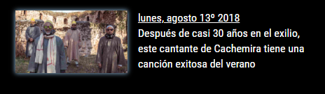

# MMM-NPR
News modules based on NPR news
## Examples

 

 

 

Works with your default language!! 

## Your terminal installation instructions

* `git clone https://github.com/cowboysdude/MMM-NPR` into the `~/MagicMirror/modules` directory.`

**Go to MagicMirror/modules/MMM-NPR and run NPM INSTALL**

## Config.js entry and options
          {
		  	disabled:t,
		  	module: "MMM-NPR",
		  	position: "top_left",
			config: {
				type: 'world'  // world or us are the only two options.
				}
		  },

